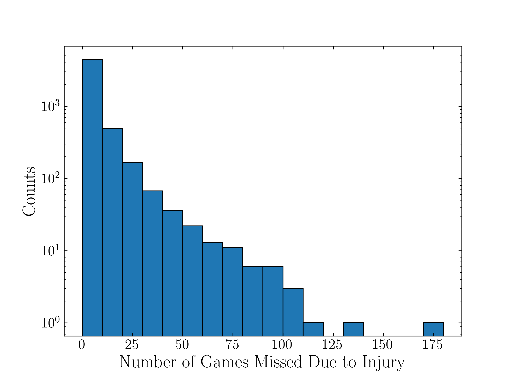
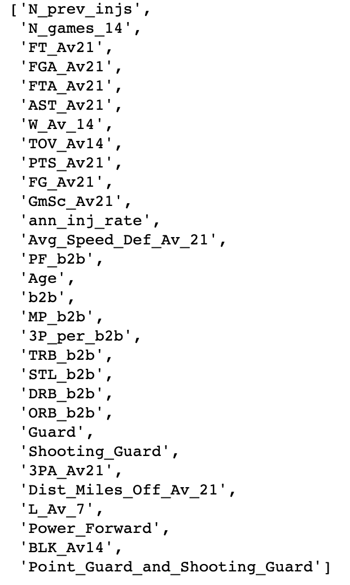
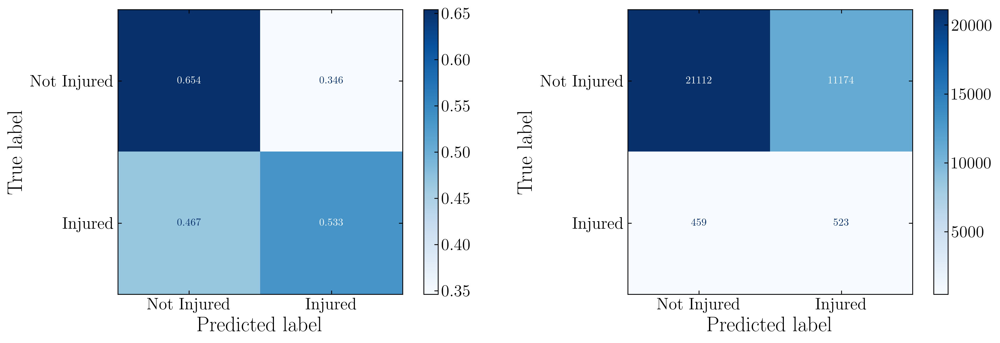
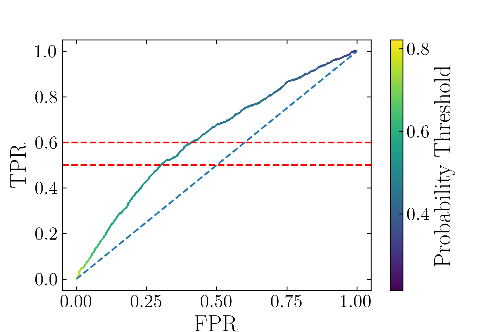
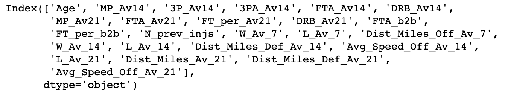
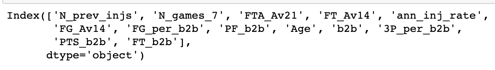
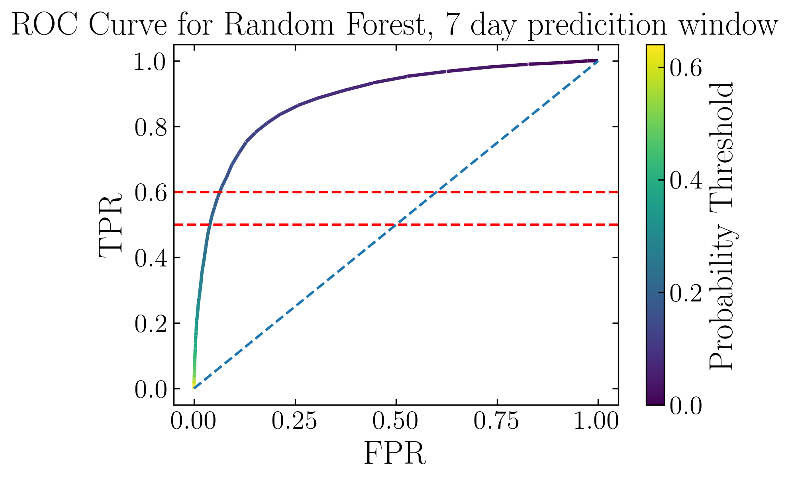
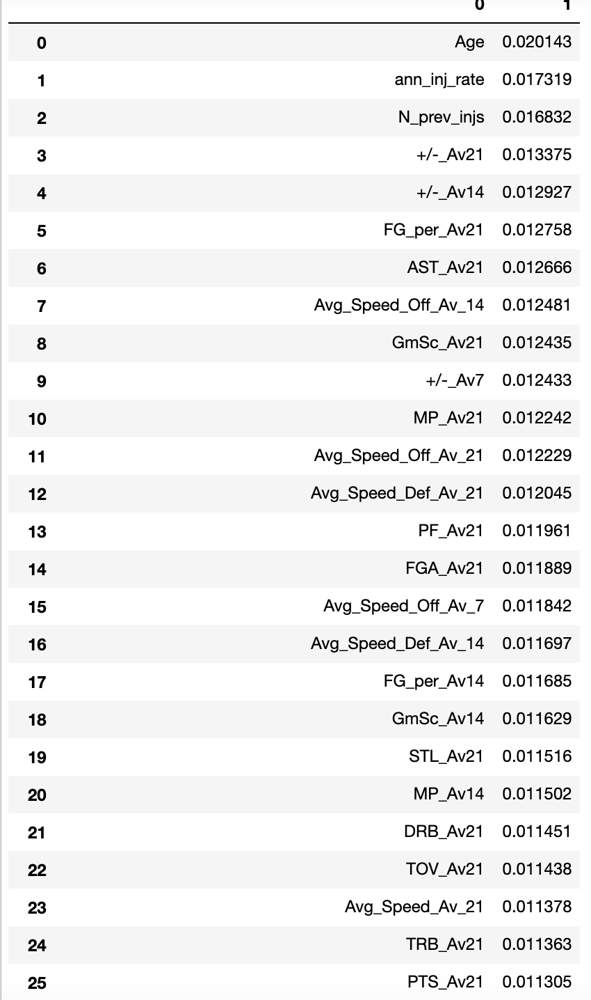
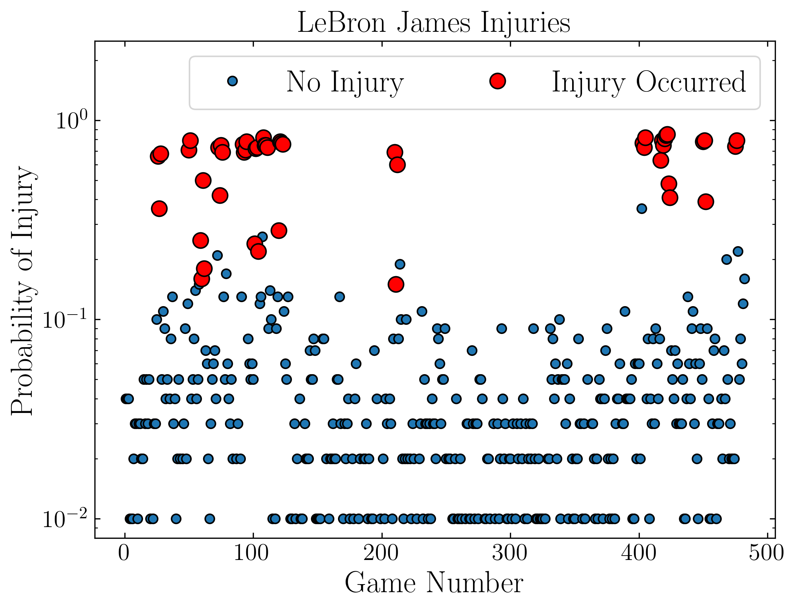

# Using Machine Learning to Classify NBA Injuries

All data used in the project [can be downloaded here](https://people.ucsc.edu/~mmrosent/nba_inj_pred.html).

This project aims to apply machine learning (ML) techniques to the problem of resting players in NBA games strategically. Specifically, we seek to understand what factors contribute to games in which players get injured, and also to see if we can train an ML algorithm to decide whether players should be rested for a given game. This second task is a difficult one, particularly because beforehand metrics must be established to determine whether a given algorithm actually aids in this task. Simply identifying a large fraction of games where players get injured is insufficient, as injured games are rare, and algorithms with even a modest false positive (FP) rate may result in players actually playing less games overall.

### Data scraping and cleaning

The data for this project was complied from three distinct sources: first, NBA injuries from 2010-2020 were downloaded from the [Pro Sports Transactions](https://www.prosportstransactions.com/basketball/Search/Search.php) website, using both the "Missed games due to injury" and the "Movement to/from injured/inactive list (IL)" filters. The second filter is necessary as these two categories are mutually exclusive, and the first category misses many injuries. See [this notebook](/notebooks/download_inj_data.ipynb) for details.

This list of injuries is then correlated with the game the player was injured in, using game logs from [Basketball reference](https://www.basketball-reference.com/) [(see this notebook).](make_inj_df.ipynb) We use custom scrapers to pull not just the games the player was injured in, but all stats from the 2010-2020 seasons for each player that appears in our list of injuries. We also pull metadata for each player, i.e. their height, weight, which hand they shoot with, and their listed position on Basketball reference. We also classify players as a "Guard," "Wing," or "Big" using their listed position on Basketball reference. Finally, we filter out all players who didn't average at least 15 minutes per game over their career.

This list of games will constitute the entries in our training data, but we obviously can't use the the statistics from the games themselves as features . One thing we can do immediately with this data is [determine the distribution of the number of games players miss due to injuries.](missed_games.ipynb)

The data have mean 5.889, and standard deviation 10.470.

To turn the in game statistics into features, statistics are windowed over different number of games before the current game, taking care not to include statistics from the game in question. We use 7, 14 and 21 day windows, and also a 1 day window corresponding to back-to-back games. [See this notebook.](windowing.ipynb)

We also include [speed-distance tracking data](https://stats.nba.com/players/speed-distance/). This data is only available starting with the 2013 season, so we include further limit our data to only include games from 2013-2020. We use selenium to build another custom scraper to pull this data, using 7, 14, and 21 day windows [(see this notebook).](speed_dist_scrape.ipynb). Finally, the speed-distance data is combined with our previous data [to form our final dataset.](make_final_dataset.ipynb) We use one-hot encoding on all catergorical data, resulting in 141 total features and 133072 examples.

### Data Analysis

We begin by using a [simple logistic regression model](log_reg.ipynb). We begin by identifying the best features in a simple manner using the correlations between the features and whether the player was injured in the a given game. We identify the 30 "best" features by keeping the 30 features with the highest correlation, but also dropping features that correspond to the same statistic but over a different time window. The best performing features found using this method are

We then use 5-fold cross-validation to optimize the hyperparameters of the logistic regression before analyzing performance on the test set. The logistic regression classifier can correctly identify around 55% of the injuries with a false positive rate of around 35%. This is a large absolute number of false positives given that the overall injury rate is around 3%

In order to investigate the best performing features in a more sophisticated manner, we also use recursive feature elimination (RFE) to identify the best performing subset of features. We again use 5-fold cross validation, and optimize the f1 score. The best scoring features are shown below.

There is considerable overlap between these two sets of features. We see that the number of previous injuries and the player's age both appear, making it appear that long term wear and tear contributes substantially to the probability of an injury. The average number of free throw attempts and free throws the player averaged over the last 3 weeks appear as well, making it seem that going to the free throw line frequency is associated with injury. Both methods of selection favor some number of the speed-distance tracking stats, though RFE favors using more. While there are several differences between the two sets of feature, one of particular note is that features chosen through correlation include far more back-to-back statistics than RFE, which only chooses one b2b feature.

The model with features chosen using RFE was then compared to training data. The performance on the training set is quite similar to the performance above. 

#### Practical application of model

As it currently stands, while the model is certainly useful for understanding what features are associated with injury, it is not practical for predicting NBA injuries. This stems from the model's FP rate, which misclassifies a large number of games. We can get a quantitative idea of how many games our classifier gains/loses by taking the number of injuries we correctly classify, multiplying by the number of games we gain by correctly classifying an injury, and subtracting the number of false positives. Applying this metric to the current model we would actually lose around 8000 games played over the whole testing dataset, since we misclassify so many games. This evaluation of the model is of course over simplified in several respects. On the one hand, it neglects benefits in injury prediction which are harder to quantify, such as the effect of injuries on future player performance, instead of just games missed. It also does not consider player-by-player performance, instead looking at the dataset as a whole, and also neglects how a player's predicted chance of injury changes over time. 

We can attempt to use the "net games" metric defined above to evaluate the performance of our ML algorithm, optimizing for net games when tuning hyperparameters. However, we do not find any substantial increase in the number of games after a grid search. The best performing models simply predict no injuries. 

One possible source of this difficulty can stem from how inherently random an injury in a given game is. Given that a player gains around 5 games for every injury we correctly predict (5.889 games is the average found [in this notebook](missed_games.ipynb), minus 1 game since the player is rested in the game we identify), we need the probability of injury we predict to be greater than ~20% before it even makes sense to rest the player. We can get a sense of how probable injuries are in a logisitic regression model by fitting a model with no class weighting. We use statsmodels to perform this task, which has the added benefit of calculating p-values and confidence intervals for each of our model coefficients. We use backwards stepwise regression to find the best model, beginning with the 60 features with the highest correlation coefficients and removing the feature with the highest p-value, one at a time. We continue in this manner until the Akaike information criterion (AIC) no longer improves. This has the added benefit of giving us another way of selecting features. The model identifies 13 features with p<0.1:

which are similar to the features identified above.

We use this model to predict probabilities for the entirety of our dataset. Over the entirety of our ~130,000 entries, only 63 have predicted probabilities larger than 20%. Thus, it appears that for the vast majority of games, we simply cannot find features such that P(inj|features) is large enough that sitting the player is worth it. There are of course many caveats here, the primary one being that these statements are conditioned on the data following the logistic regression model. It is possible that a more sophisticated non-linear model could better fit the probabilities.

### Other models

We attempted to use several more sophisticated learning algorithms to fit our dataset. We first attempted to maximize the "net games" criterion we identified previously. We tried fitting the data using Decision Trees, Random Forests, and Support Vector Machines. The results [can be found here](other_algos_net_games.ipynb). None of the more advanced classifiers resulted in a substantive increase over the logisitc regression in terms of net games. Generally, these classifiers ended up classifying few, if any games as injuries, resulting in net games hovering around 0.

<<<<<<< HEAD
We also tried to train the above algorithms [using f1 score as our metric.](other_algos_f1.ipynb) In this case these algorithms performed marginally better than the logistic regression, but not by a substantial margin.
=======
We also tried to train the above algorithms using f1 score as our metric. In this case these algorithms performed marginally better than the logistic regression, but not by a substantial margin.
>>>>>>> parent of 62a3d24... Fixing README links

### Comparison to Talduker et al. (2016) using 7 day predicition window

<<<<<<< HEAD
Finally, we compare our model [to that of Talduker et al. (2016).](http://www.sloansportsconference.com/wp-content/uploads/2016/02/1590-Preventing-in-game-injuries-for-NBA-players.pdf) These authors not only used a much smaller dataset (~500 injuries from 2013-2015) to classify injuries, but, more importantly, they used what they term a "prediction window" when labeling games as associated with an injury. A game as associated with an injury if the player is injured within the prediction window following the game. This is in contrast to our previous method, which only associated the game closest to a given injury. These authors claim that a 7 day prediction window is optimal, so we reanalyze our data with all games where a player was injured in the 7 days following as associated with an injury. 
=======
Finally, we compare our model to that of Talduker et al. (2016). These authors not only used a much smaller dataset (~500 injuries from 2013-2015) to classify injuries, but, more importantly, they used what they term a "predicition window" when labeling games as associated with an injury. A game as associated with an injury in the player is injured within the predicition windownfollowing the game. These authors claim that a 7 day predicition window is optimal, so we reanalyze our data with all games where a player was injured in the 7 days following as associated with an injury. 
>>>>>>> parent of 62a3d24... Fixing README links

[We find results similar to Talduker et al. when expanding this definition of injury.](paper_comp.ipynb) Interestingly, logistic regression performs much more poorly on this dataset when compared to a Random Forest. Logistic regression has an AUC of 0.62 on the testing data after hyperparameter tuning, while the Random Forest has an AUC 0.89.

We can use the Random Forest to generate feature importances for this metric. The top 25 features are shown below:

While many of the results are similar to previously identified features, this method notably identifies +/- as being very important, and also focuses heavily on the average speed statistic.

This method also shows nice performance on a player-to-player basis. For example, the injury predictions for LeBron James are shown below. Notably, this method does not have the injury probability increase substantially with time, which we saw in some logisitic regression models.

<<<<<<< HEAD
While this method of associating games with injury results in better scoring learning algorithms, this improvement in performance is rather unsurprising, as we have greatly expanded our definition of a game being associated with an injury. The downside is that it is much more unclear with this methodology whether resting a player in games "associated" with an injury will actually prevent the player from getting injured. One place to follow up would be to see how often games that were associated with an injury using our previous methods, i.e. the games immediately preceding an injury, are flagged with this new learning method. Our previous "net games" metric also no longer applies here, since multiple games are associated with the same injury. Another avenue for future inquiry is to calculate the average number of games associated with the same injury, and use that to define a new "net games" metric for this data.

### Conclusions

We use a variety of ML techniques to try to predict games in which an NBA player will be injured, using several different metrics to assess the importance of various features in associating games with injuries. Across these different methods of selecting features, a player's age, the number of times they've been injured previously, and their annual injury rate all appear to be important metrics in predicting injury. Player's average speed and total distance run are also important predictors of injury, with the learning algorithms tending to favor longer averages (i.e. three week average) as opposed to averages over just the past week. Free throws, both total made and number of attempts, appear quite frequently as important features, as do number of minutes played. Interestingly, when associating only the closest game with an injury, many back-to-back features appear important, particularly when looking at p-values in a logistic regression. When associating all games within 7 days of an injury however, no back-to-back features are selected.
=======
While this method of associating games with injury results in better scoring learning algorithms, this improvement in performance is rather unsurprising, as we have greatly expanded our definition of whether or game is associate with an injury. It is much more unclear with this methodology whether resting a player in games "associated" with an injury will actually prevent the player from getting injured. Once place to follow up would be to see how often games that were associated with an injury using our previous methods, i.e. the game in which the player got injured, are flagged with this new learning method. Our previous "net games" metric also no longer applies here, since multiple games are associated with the same injuries. Another avenue for future inquiry is to calculate the average number of games associated with the same injury, and use that to define a new "net games" metric for this data.

### Conclusions

We use a variety of ML techniques to try to predict games in which an NBA player with injured, using several different metrics to asses the importance of various features in associating games with injuries. Across these different methods of selecting features, a player's age, the number of times they've been injured prevously, and their annual injury rate all appear to be important metrics in predicting injury. Player's average speed and total distance run are also important predictors of injury, with the learning algorithms tending to favor longer averages (i.e. three week average) as opposed to averages over just the past week. Free throws, both total made and number of attempts, appear quite frequently as important features, as do number of minutes played. Interestingly, when associating only the closest game with an injury, many back-to-back features appear important, particuarly when looking at p-values in a logistic regression. When associating all games within 7 days of an injury however, no back-to-back features are selected.
>>>>>>> parent of 62a3d24... Fixing README links

We also consider the practiciality of implenmenting a ML algorithm for real NBA injury prediction. At present, it seems that algorithms trained on data associating the closest game with an injury cannot find high enough injury probabilities to be viable. It is possible that by adding more sophisticated features these algorithms can be improved. While algorithms trained on longer predicition windows have better performance, it is not at present clear to what extent resting the players in games these algorithms identify as associated with injury will actually reduce injury rates.
